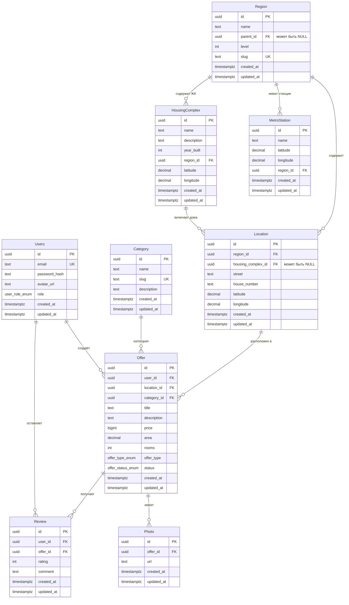

# Схема базы данных: Cian

## Отношение: Users

**Описание**:  
Хранит уникальных пользователей системы. Поддерживает роли: обычный пользователь, владелец, риэлтор.

### Функциональные зависимости:

{ID} → Email, PasswordHash, AvatarUrl, Role, CreatedAt, UpdatedAt  
{Email} → ID, PasswordHash, AvatarUrl, Role, CreatedAt, UpdatedAt

> **Пояснение**:  
> - `ID` — первичный ключ (UUID).  
> - `Email` — уникальный атрибут → суперключ.  
> - Поле `role` использует ENUM (`user`, `owner`, `realtor`).

---

## Отношение: Category

**Описание**:  
Классифицирует типы недвижимости (квартира, дом и т.д.) для упрощения фильтрации.

### Функциональные зависимости:

{ID} → Name, Slug, Description, CreatedAt, UpdatedAt  
{Slug} → ID, Name, Description, CreatedAt, UpdatedAt

> **Пояснение**:  
> - `ID` — первичный ключ (UUID).  
> - `Slug` — уникальный человекочитаемый идентификатор → суперключ.

---

## Отношение: Region

**Описание**:  
Иерархическая структура административных регионов: Страна → Область → Город → Район.

### Функциональные зависимости:

{ID} → Name, ParentID, Level, Slug, CreatedAt, UpdatedAt  
{Slug} → ID, Name, ParentID, Level, CreatedAt, UpdatedAt  
{ParentID, Name} → ID, Slug, Level, CreatedAt, UpdatedAt

> **Пояснение**:  
> - `ID` — первичный ключ (UUID).  
> - `Slug` — уникальный → суперключ.  
> - `{ParentID, Name}` — уникальная комбинация внутри родителя → суперключ.  
> - Рекурсивная связь через `ParentID → Region.ID`.

---

## Отношение: MetroStation

**Описание**:  
Хранит станции метро с геокоординатами и привязкой к региону (для поиска «рядом с метро»).

### Функциональные зависимости:

{ID} → Name, Latitude, Longitude, RegionID, CreatedAt, UpdatedAt  
{Name, RegionID} → ID, Latitude, Longitude, CreatedAt, UpdatedAt

> **Пояснение**:  
> - `ID` — первичный ключ (UUID).  
> - `{Name, RegionID}` — уникальная комбинация → суперключ.  
> - Координаты имеют строгие диапазоны: широта ∈ [−90, 90], долгота ∈ [−180, 180].

---

## Отношение: HousingComplex

**Описание**:  
Хранит информацию о жилых комплексах (ЖК): название, год постройки, описание, координаты. Позволяет фильтровать объявления по ЖК.

### Функциональные зависимости:

{ID} → Name, Description, YearBuilt, RegionID, Latitude, Longitude, CreatedAt, UpdatedAt  
{Name, RegionID} → ID, Description, YearBuilt, Latitude, Longitude, CreatedAt, UpdatedAt

> **Пояснение**:  
> - `ID` — первичный ключ (UUID).  
> - `{Name, RegionID}` — уникальная комбинация → суперключ (в пределах одного региона не может быть двух ЖК с одинаковым названием).  
> - Привязан к региону (например, району).  
> - Содержит геокоординаты для отображения на карте.

---

## Отношение: Location

**Описание**:  
Хранит нормализованные физические адреса (улица, дом) с геокоординатами. Может быть привязан к жилому комплексу.

### Функциональные зависимости:

{ID} → RegionID, HousingComplexID, Street, HouseNumber, Latitude, Longitude, CreatedAt, UpdatedAt  
{RegionID, Street, HouseNumber} → ID, HousingComplexID, Latitude, Longitude, CreatedAt, UpdatedAt

> **Пояснение**:  
> - `ID` — суррогатный первичный ключ (UUID).  
> - Комбинация `{RegionID, Street, HouseNumber}` — уникальный бизнес-ключ → суперключ.  
> - Поле `HousingComplexID` — опциональная ссылка на жилой комплекс (если дом входит в ЖК).

---

## Отношение: Offer

**Описание**:  
Хранит объявления о недвижимости. Каждое объявление принадлежит одному пользователю, категории и локации.

### Функциональные зависимости:

{ID} → UserID, LocationID, CategoryID, Title, Description, Price, Area, Rooms, OfferType, Status, CreatedAt, UpdatedAt  
{UserID, Title, LocationID, CreatedAt} → ID, Description, Price, Area, Rooms, OfferType, Status, UpdatedAt

> **Пояснение**:  
> - `ID` — первичный ключ (UUID).  
> - `{UserID, Title, LocationID, CreatedAt}` — уникальный бизнес-ключ → суперключ.  
> - `OfferType` и `Status` — ENUM-типы (`sale`/`rent`, `active`/`sold`/`archived`).  
> - Все числовые поля имеют бизнес-ограничения (цена ≥ 0, площадь > 0 и т.д.).

---

## Отношение: Photo

**Описание**:  
Хранит ссылки на фотографии объявлений. Одно объявление может иметь множество фото.

### Функциональные зависимости:

{ID} → OfferID, URL, CreatedAt, UpdatedAt  
{OfferID, URL} → ID, CreatedAt, UpdatedAt

> **Пояснение**:  
> - `ID` — первичный ключ (UUID).  
> - `{OfferID, URL}` — одна и та же ссылка не может быть прикреплена дважды к одному объявлению → суперключ.

---

## Отношение: Review

**Описание**:  
Хранит отзывы пользователей на объявления (оценка и комментарий).

### Функциональные зависимости:

{ID} → UserID, OfferID, Rating, Comment, CreatedAt, UpdatedAt  
{UserID, OfferID} → ID, Rating, Comment, CreatedAt, UpdatedAt

> **Пояснение**:  
> - `ID` — первичный ключ (UUID).  
> - `{UserID, OfferID}` — пользователь может оставить только один отзыв на объявление → суперключ.  
> - Оценка ограничена диапазоном [1, 5].

---

## ERD

