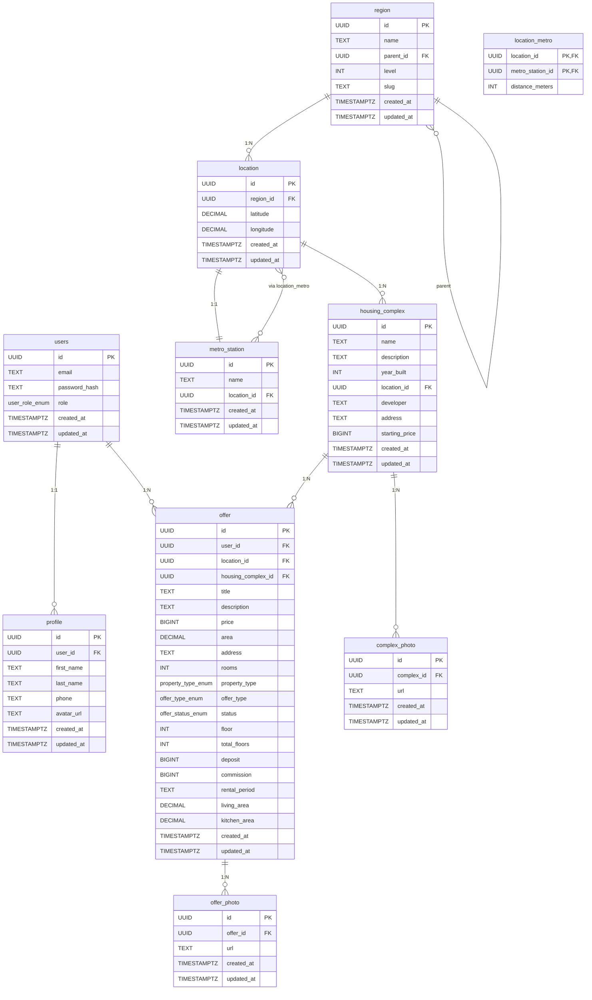

```mermaid
erDiagram
    users ||--o{ profile : "1:1"
    users ||--o{ offer : "1:N"
    region }o--|| region : "parent"
    region ||--o{ location : "1:N"
    location ||--|| metro_station : "1:1"
    location }o--o{ metro_station : "via location_metro"
    location ||--o{ housing_complex : "1:N"
    housing_complex ||--o{ offer : "1:N"
    housing_complex ||--o{ complex_photo : "1:N"
    offer ||--o{ offer_photo : "1:N"

    users {
        UUID id PK
        TEXT email
        TEXT password_hash
        user_role_enum role
        TIMESTAMPTZ created_at
        TIMESTAMPTZ updated_at
    }

    profile {
        UUID id PK
        UUID user_id FK
        TEXT first_name
        TEXT last_name
        TEXT phone
        TEXT avatar_url
        TIMESTAMPTZ created_at
        TIMESTAMPTZ updated_at
    }

    region {
        UUID id PK
        TEXT name
        UUID parent_id FK
        INT level
        TEXT slug
        TIMESTAMPTZ created_at
        TIMESTAMPTZ updated_at
    }

    location {
        UUID id PK
        UUID region_id FK
        DECIMAL latitude
        DECIMAL longitude
        TIMESTAMPTZ created_at
        TIMESTAMPTZ updated_at
    }

    metro_station {
        UUID id PK
        TEXT name
        UUID location_id FK
        TIMESTAMPTZ created_at
        TIMESTAMPTZ updated_at
    }

    location_metro {
        UUID location_id PK,FK
        UUID metro_station_id PK,FK
        INT distance_meters
    }

    housing_complex {
        UUID id PK
        TEXT name
        TEXT description
        INT year_built
        UUID location_id FK
        TEXT developer
        TEXT address
        BIGINT starting_price
        TIMESTAMPTZ created_at
        TIMESTAMPTZ updated_at
    }

    offer {
        UUID id PK
        UUID user_id FK
        UUID location_id FK
        UUID housing_complex_id FK
        TEXT title
        TEXT description
        BIGINT price
        DECIMAL area
        TEXT address
        INT rooms
        property_type_enum property_type
        offer_type_enum offer_type
        offer_status_enum status
        INT floor
        INT total_floors
        BIGINT deposit
        BIGINT commission
        TEXT rental_period
        DECIMAL living_area
        DECIMAL kitchen_area
        TIMESTAMPTZ created_at
        TIMESTAMPTZ updated_at
    }

    offer_photo {
        UUID id PK
        UUID offer_id FK
        TEXT url
        TIMESTAMPTZ created_at
        TIMESTAMPTZ updated_at
    }

    complex_photo {
        UUID id PK
        UUID complex_id FK
        TEXT url
        TIMESTAMPTZ created_at
        TIMESTAMPTZ updated_at
    }
```