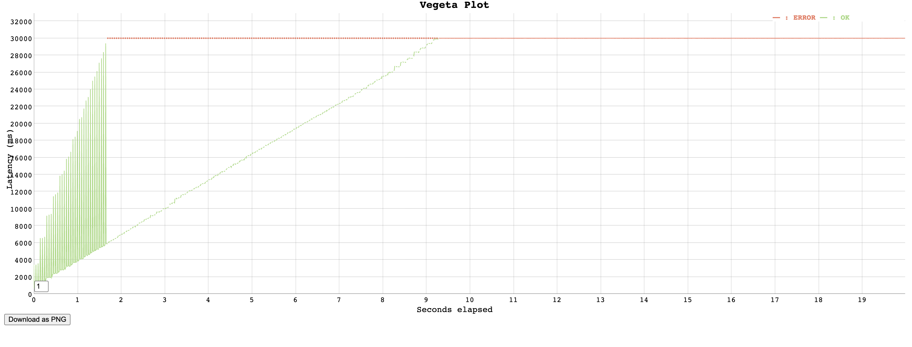
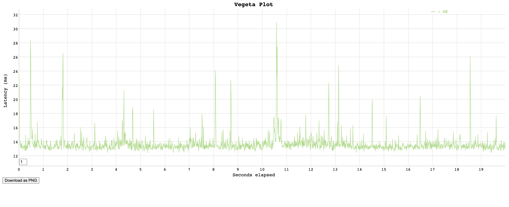
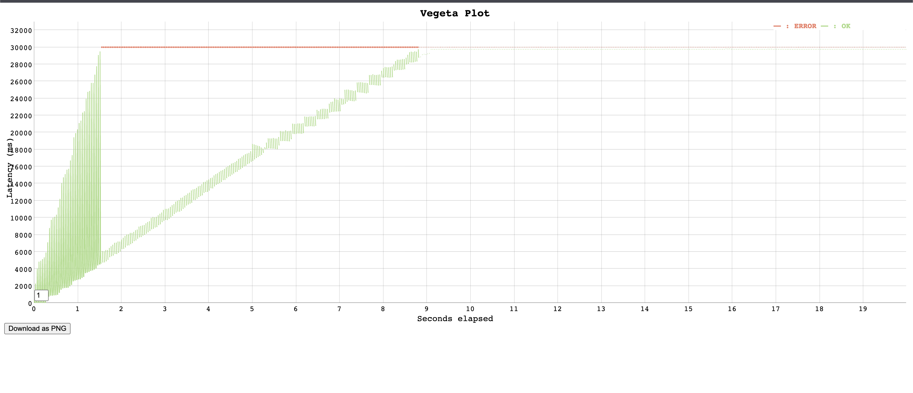

# Отчет о нагрузочном тестировании

## Описание приложения

**Основная сущность:** Объявления о недвижимости (`offer`)

**Обоснование выбора:** Объявления (offer) являются центральной бизнес-сущностью приложения недвижимости. Они связывают пользователей, локации, жилые комплексы и содержат основную информацию для пользователей.

**Тестируемые API:**
- `POST /api/v1/offers/create` - создание объявления
- `GET /api/v1/offers` - получение списка объявлений (с фильтрами)
- `GET /api/v1/offers/{id}` - получение конкретного объявления
- `PUT /api/v1/offers/update/{id}` - обновление объявления
- `DELETE /api/v1/offers/delete/{id}` - удаление объявления
- `GET /api/v1/profile/myoffers/{user_id}` - получение объявлений пользователя

---

## Инструменты

- **Нагрузочное тестирование:** `vegeta` (https://github.com/tsenart/vegeta)
- **Мониторинг:** `htop`, `pg`
- **Скрипты** `./scripts`, `./sql`

## Результаты

